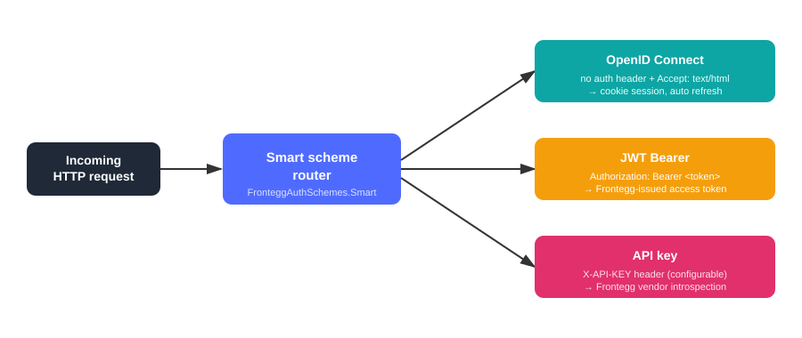
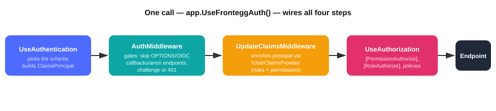
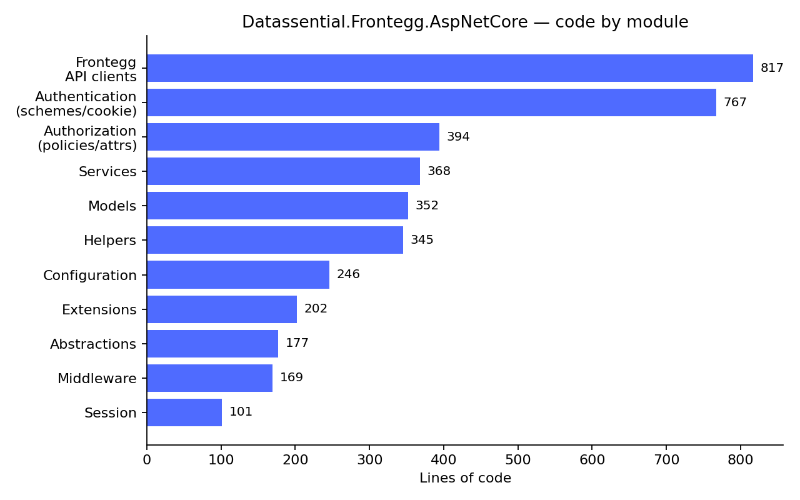

# Building a drop-in NuGet package for Frontegg auth in ASP.NET Core

**Why this article:** most write-ups on [Frontegg](https://frontegg.com/) show how to log a single app in. This one is about the next step teams hit once Frontegg needs to protect *several* ASP.NET Core services consistently — routing three different proof-of-identity styles to the right handler, enriching users with roles/permissions, and gating controllers, all without copy-pasting the same wiring into every repo. The goal here is to share the design decisions and trade-offs behind that integration layer, so other teams evaluating a similar build have a reference for the shape it can take — not a specific product's source code.

Every product team building on Frontegg tends to solve the same problem separately: wire up Frontegg as a CIAM provider, handle three different ways a request can prove who it is, enrich the user with roles and permissions, and gate controllers accordingly. Each app re-implements it slightly differently, which means multiple sets of bugs instead of one.

The fix is a small NuGet library that packages that integration once, so any ASP.NET Core service adds it with a single `AddFronteggAuth()` call and gets authentication, authorization, and claims enrichment for free.

## The problem: three ways to prove who you are

A single service typically needs to accept:

- **Browser users** — interactive login via OpenID Connect, backed by a cookie session.
- **Service-to-service calls** — Frontegg-issued JWT access tokens on the `Authorization: Bearer` header.
- **Machine/vendor callers** — Frontegg API keys on a configurable header (`X-API-KEY` by default).

Handling all three well means picking the right scheme *per request*, not per app — a browser tab and a backend job hit the same endpoint differently. That routing logic is exactly the kind of thing worth writing once.



The router inspects the incoming request — presence of an API-key header, a `Bearer` prefix, or neither — and forwards it to the matching authentication scheme automatically. Nothing in the controller code needs to know which one fired.

## Key design decisions

**One request pipeline, four steps.** `UseFronteggAuth()` chains `UseAuthentication` → a gating middleware → a claims-enrichment middleware → `UseAuthorization`, so a host app wires the whole thing in one line instead of reassembling middleware order by hand.



The gating middleware (`AuthMiddleware`) skips CORS preflight, OIDC callback paths, and `[AllowAnonymous]` endpoints, then either challenges the browser via OIDC or returns a bare 401 for token-based callers — no redirect loop for an API client that was never going to follow it. The enrichment middleware then attaches roles and permissions to the principal before authorization runs.

**Product-neutral by design.** Nothing in the package hardcodes any single product's permission model. Claim-type names are configurable (`FronteggClaimTypeOptions`), and every piece of product-specific behavior is an interface a consuming app can override after calling `AddFronteggAuth`:

| Interface | Default | Swap it for |
|---|---|---|
| `IUserClaimsProvider` | calls an internal permissions service | reading permissions straight from the Frontegg API |
| `IPermissionIdResolver` | maps permission keys to numeric IDs via config | a custom mapping source |
| `IAccountStatusValidator` | allow-all | gating access on an account-status claim |
| `IClaimsTransformer` | no-op | adding product-specific roles after enrichment |

**Authorization that matches how the org already thinks about permissions.** Three attribute styles cover native Frontegg permission keys, legacy numeric permission IDs, and role names — plus a `[SkipAuth]` escape hatch and a dynamic policy provider so `RequireAuthorization("perm:fe.secure.read")` works without pre-registering every policy.

**Fail-safe by default, not by accident.** Two failure paths were deliberately made to behave *differently*. `IUserPermissionsService` throws on a provider outage, because an empty permission set is indistinguishable from "this user has none" and could silently widen access for an inverted check. `IIdentityUserService.GetUserAsync()` fails open instead — but only because it always runs *after* authorization has already been decided, so an unenriched result can't grant anything it shouldn't.

**Redis is optional, and never blocks startup.** Cookie session tickets can live in Redis, but the connection is resolved lazily on first use rather than during service registration — so a Redis outage never stalls app startup. Resolution falls back in order: the package's own connection string → a Redis connection the host app already registered → an in-memory store, with a warning logged so the fallback isn't silent.

## What's inside

The package is organized into eleven focused folders — clients for the Frontegg API, the three-scheme authentication layer, the attribute/policy-based authorization layer, pluggable services, and the session/ticket store:



The `Frontegg/` clients and the `Authentication/` scheme setup are the largest pieces — unsurprising, since token validation, refresh, and the OIDC/cookie/JWT/API-key routing carry most of the integration complexity. Everything under `Abstractions/` is the small, stable interface surface that keeps the rest swappable.

## Shipping it

The package targets `net10.0`, references only the ASP.NET Core packages not already in the shared framework (`JwtBearer`, `OpenIdConnect`, `Amazon.AspNetCore.DataProtection.SSM`, `StackExchange.Redis`), and produces symbol packages (`.snupkg`) alongside the main `.nupkg` for source-level debugging downstream.

Release flow is a plain `dotnet pack` / `dotnet nuget push` to whichever feed hosts the package — a private feed, or nuget.org:

```bash
dotnet build FronteggAuth -c Release
dotnet pack  FronteggAuth -c Release /p:Version=1.6.0
dotnet nuget push FronteggAuth/bin/Release/FronteggAuth.1.6.0.nupkg \
  --source https://<your-private-feed> --api-key <key>
```

Consuming apps then just:

```bash
dotnet add package FronteggAuth --version 1.6.0
```

```csharp
builder.Services.AddFronteggAuth(builder.Configuration);
// ...
app.UseFronteggAuth();   // UseAuthentication → gate → enrich → UseAuthorization
```

## Key takeaways

- **Centralize the routing decision, not the business logic.** The smart scheme router and pipeline are shared; permission models and claim sources stay pluggable per product.
- **Design failure modes on purpose.** Fail-closed where an empty result could look like "no access needed"; fail-open only where authorization has already run.
- **Never let an optional dependency block startup.** Lazy Redis resolution with a safe in-memory fallback means one config value determines behavior, not a network dial at boot.
- **One line in, one line wired.** `AddFronteggAuth()` + `UseFronteggAuth()` is the entire integration surface for a new service.
